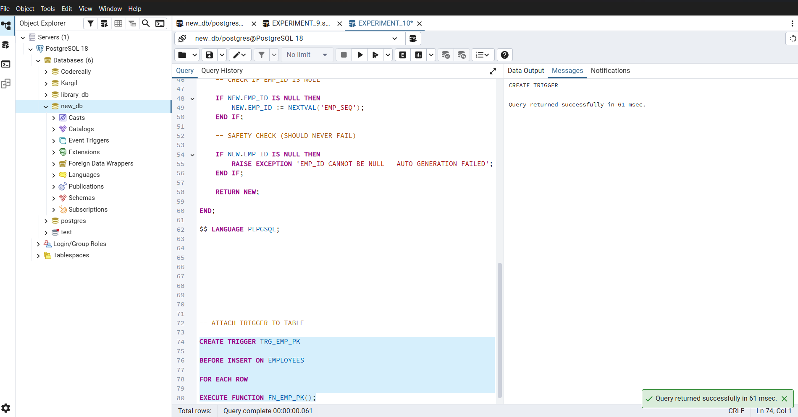
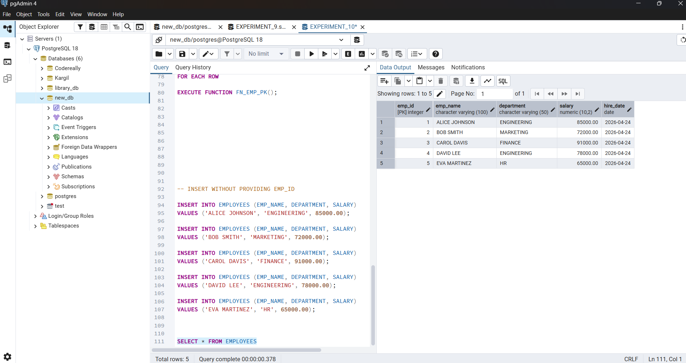
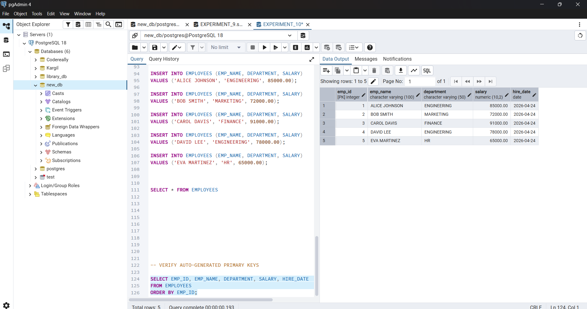
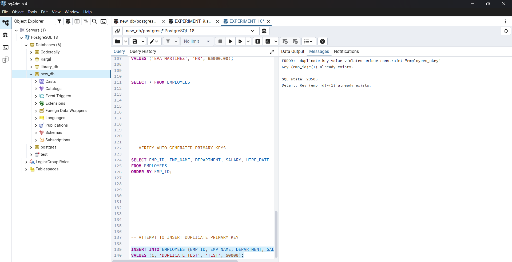
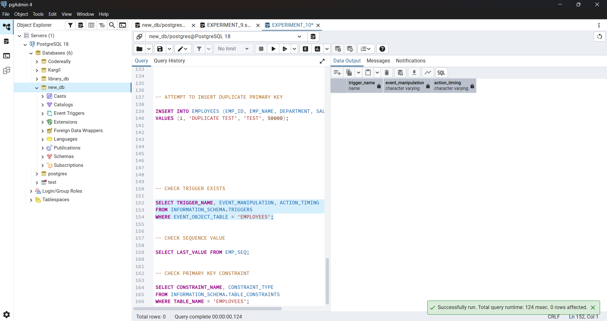
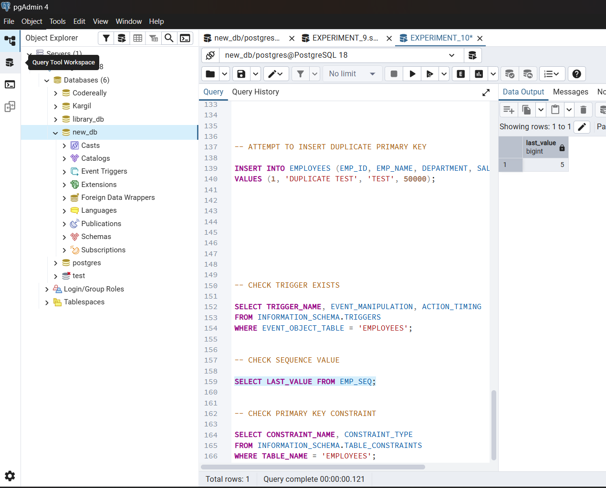
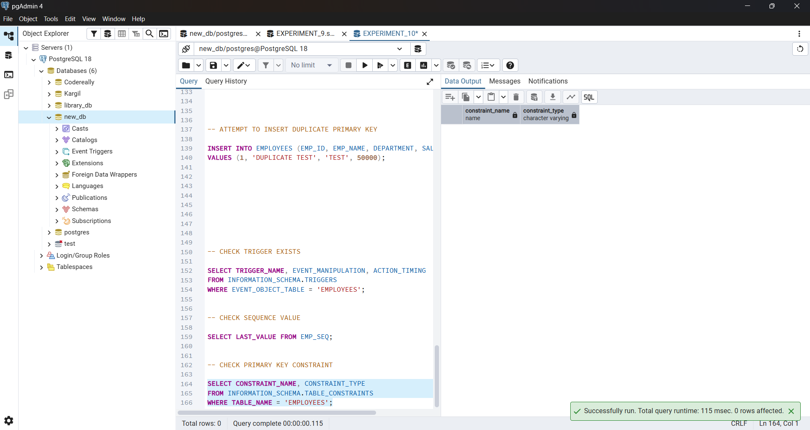

# EXPERIMENT - 10

## Student Name: Arnav Prajapati			
## UID: 24BAI70131
## Branch: CSE - AIML				
## Section/Group: 24AIT_KRG-G1				
## Date of Performance: 24/04/26
## Subject Name: DBMS				
## Subject Code: 24CSH-298

## 1.	Aim
    To design a trigger that automatically implements the functionality of a primary key, ensuring unique identification of records without manual intervention.


## 2.	Software Requirements
    •	Database Management System:
    o	Oracle Database Express Edition (Oracle XE)
    o	PostgreSQL Database
    •	Database Administration Tool / Client Tool:
    o	Oracle SQL Developer (for Oracle XE)
    o	pgAdmin (for PostgreSQL)

## 3.	Objectives
    To create a database trigger that automatically enforces primary key constraints or generates unique key values, replicating the functionality of a stored procedure.

## 4.	Problem Statement
    In enterprise databases, primary keys must be unique for every record. Manual assignment of keys can lead to errors.
    Design a trigger that:
    Automatically generates or enforces a primary key value during record insertion.
    Implements the logic similar to a stored procedure.
    Demonstrates automated primary key functionality for a table.
    (Industry relevance: Amazon, Flipkart, Oracle)


## 5.	Practical/Experiment Steps
    o	Identify the table requiring automated primary key enforcement.

    o	Design a trigger that activates before insert operations.

    o	Ensure that every new record receives a unique primary key automatically.

    o	Validate the trigger by inserting multiple records and verifying unique keys.

## 6.	Procedure
    •	Established a connection to the PostgreSQL server and initialized the working environment using a database client such as pgAdmin. 
    •	Created an EMPLOYEES table containing attributes such as employee ID, employee name, gender, and salary. 
    •	Inserted a balanced dataset into the table, ensuring that both male and female employee records were present for meaningful analysis. 
    •	Designed a stored procedure named GET_EMP_COUNT_BY_GENDER with properly defined parameters: 
    o	An IN parameter to accept the gender input. 
    o	An OUT parameter to return the total employee count. 
    o	An INOUT parameter to manage and update the execution status. 
    •	Implemented the procedure logic using PL/pgSQL to perform a COUNT(*) operation, filtering employee records based on the provided gender value. 
    •	Updated the status variable inside the procedure to 'SUCCESS' after successful execution of the query. 
    •	Wrote an anonymous block to test the procedure, where variables were declared and initialized, including setting the gender input (e.g., 'MALE') and initial status as 'PENDING'. 
    •	Executed the procedure using the CALL statement, passing the required parameters and capturing the output values. 
    •	Displayed the results using the RAISE NOTICE statement, printing both the employee count and the updated status to the output console. 
    •	Verified the correctness of the output by comparing the returned count with the actual number of records present in the EMPLOYEES table.
## 7.	SQL Queries / Code
    ```sql
        -- DROP TABLE IF EXISTS (SAFE RE-RUN)

        DROP TABLE IF EXISTS EMPLOYEES CASCADE;
        DROP SEQUENCE IF EXISTS EMP_SEQ;


        -- STEP 1: CREATE TABLE
        -- CREATE TABLE
        CREATE TABLE EMPLOYEES (

            EMP_ID      INTEGER       PRIMARY KEY,
            EMP_NAME    VARCHAR(100)  NOT NULL,
            DEPARTMENT  VARCHAR(50)   NOT NULL,
            SALARY      NUMERIC(10,2) NOT NULL,
            HIRE_DATE   DATE          DEFAULT CURRENT_DATE

        );

        -- STEP 2: CREATE SEQUENCE
        -- CREATE SEQUENCE FOR PRIMARY KEY GENERATION

        CREATE SEQUENCE EMP_SEQ
            START WITH    1
            INCREMENT BY  1
            NO CYCLE;


        -- STEP 3: CREATE TRIGGER FUNCTION
        -- TRIGGER FUNCTION TO AUTO-GENERATE PRIMARY KEY

        CREATE OR REPLACE FUNCTION FN_EMP_PK()
        RETURNS TRIGGER AS $$

        BEGIN

            -- CHECK IF EMP_ID IS NULL

            IF NEW.EMP_ID IS NULL THEN
                NEW.EMP_ID := NEXTVAL('EMP_SEQ');
            END IF;

            -- SAFETY CHECK (SHOULD NEVER FAIL)

            IF NEW.EMP_ID IS NULL THEN
                RAISE EXCEPTION 'EMP_ID CANNOT BE NULL — AUTO GENERATION FAILED';
            END IF;

            RETURN NEW;

        END;

        $$ LANGUAGE PLPGSQL;


        -- STEP 4: CREATE TRIGGER
        -- ATTACH TRIGGER TO TABLE

        CREATE TRIGGER TRG_EMP_PK

        BEFORE INSERT ON EMPLOYEES

        FOR EACH ROW

        EXECUTE FUNCTION FN_EMP_PK();

        -- STEP 5: INSERT TEST RECORDS

        -- INSERT WITHOUT PROVIDING EMP_ID

        INSERT INTO EMPLOYEES (EMP_NAME, DEPARTMENT, SALARY)
        VALUES ('ALICE JOHNSON', 'ENGINEERING', 85000.00);

        INSERT INTO EMPLOYEES (EMP_NAME, DEPARTMENT, SALARY)
        VALUES ('BOB SMITH', 'MARKETING', 72000.00);

        INSERT INTO EMPLOYEES (EMP_NAME, DEPARTMENT, SALARY)
        VALUES ('CAROL DAVIS', 'FINANCE', 91000.00);

        INSERT INTO EMPLOYEES (EMP_NAME, DEPARTMENT, SALARY)
        VALUES ('DAVID LEE', 'ENGINEERING', 78000.00);

        INSERT INTO EMPLOYEES (EMP_NAME, DEPARTMENT, SALARY)
        VALUES ('EVA MARTINEZ', 'HR', 65000.00);


        SELECT * FROM EMPLOYEES


        -- STEP 6: VERIFY RESULTS
        -- VERIFY AUTO-GENERATED PRIMARY KEYS

        SELECT EMP_ID, EMP_NAME, DEPARTMENT, SALARY, HIRE_DATE
        FROM EMPLOYEES
        ORDER BY EMP_ID;


        -- STEP 7: DUPLICATE KEY TEST

        -- ATTEMPT TO INSERT DUPLICATE PRIMARY KEY

        INSERT INTO EMPLOYEES (EMP_ID, EMP_NAME, DEPARTMENT, SALARY)
        VALUES (1, 'DUPLICATE TEST', 'TEST', 50000);


        -- STEP 8: ADMIN / VERIFICATION QUERIES

        -- CHECK TRIGGER EXISTS

        SELECT TRIGGER_NAME, EVENT_MANIPULATION, ACTION_TIMING
        FROM INFORMATION_SCHEMA.TRIGGERS
        WHERE EVENT_OBJECT_TABLE = 'EMPLOYEES';

        -- CHECK SEQUENCE VALUE

        SELECT LAST_VALUE FROM EMP_SEQ;

        -- CHECK PRIMARY KEY CONSTRAINT

        SELECT CONSTRAINT_NAME, CONSTRAINT_TYPE
        FROM INFORMATION_SCHEMA.TABLE_CONSTRAINTS
        WHERE TABLE_NAME = 'EMPLOYEES';
    ```

## 8.Input/Output Analysis
### OUTPUT SCREENSHOTS
### a:
	
### b:
    
### c:
    
### d:
    
### e:
    
### f:
    
### g: 
    

## 9.	Learning Outcomes
    •	After completing this experiment, the learner will be able to:
    •	Understand the purpose and working of database triggers.
    •	Implement automated primary key functionality using triggers.
    •	Ensure data integrity without manual key assignment.
    •	Apply trigger-based automation in real-world enterprise applications such as Amazon, Flipkart,  and Oracle.

