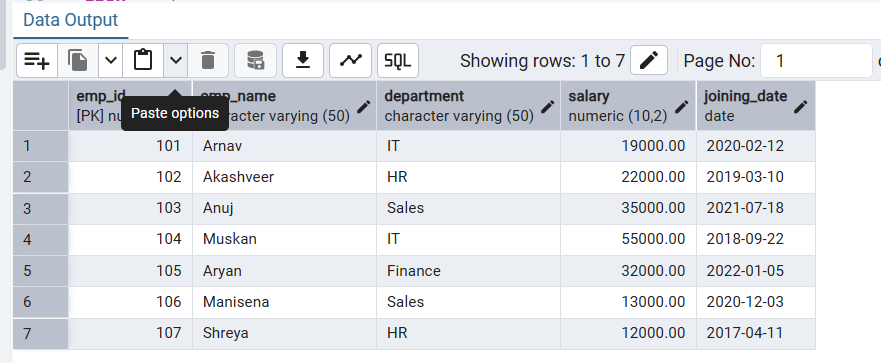
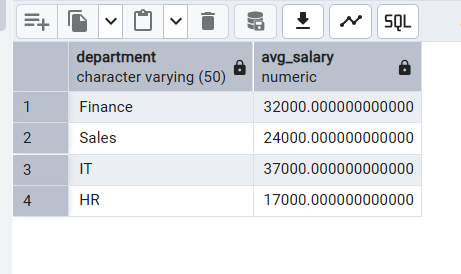
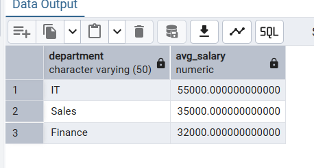

# Experiment 2: Advanced Data Aggregation and Filtering 

## 1. Aim of the Session
The aim of this practical is to learn how to use group functions and conditional filtering in SQL. In this session, we use the GROUP BY, HAVING, and ORDER BY clauses to analyze employee data and extract useful information such as department-wise average salary.

## 2. Objective of the Session
By completing this practical, I achieved the following objectives:
•	Created an employee table using suitable data types such as NUMERIC for salary and DATE for joining date.
•	Learned how to use aggregate functions (especially AVG) to calculate values for a group of records.
•	Understood the difference between WHERE (filters individual rows) and HAVING (filters grouped results).
•	Learned how to sort the final output using the ORDER BY clause.

## 3. Practical / Experiment Steps
The following tasks were performed in this experiment:
1.	Created the employee table with proper constraints and salary precision.
2.	Inserted employee records from different departments such as IT, HR, Sales, and Finance.
3.	Used the GROUP BY clause to calculate the average salary for each department.
4.	Applied the HAVING clause to show only those departments where the average salary is above a given value.
5.	Combined WHERE, GROUP BY, HAVING, and ORDER BY in a single query to get more refined and meaningful results.

## 4. Procedure of the Practical
The experiment was carried out using the following steps:
1.	Logged into PostgreSQL using pgAdmin 4 with localhost as the server.
2.	Created the employee table using the CREATE TABLE command.
3.	Inserted employee records using multiple INSERT statements.
4.	Verified the data using SELECT * to make sure all records were stored correctly.
5.	Used GROUP BY to calculate average salary for each department.
6.	Applied HAVING to display only high-paying departments (average salary greater than 30,000).
7.	Used a final query with WHERE, GROUP BY, HAVING, and ORDER BY to filter employees, group them by department, and sort the results.
8.	Took screenshots of the output and saved the SQL file for record purposes.

## 5. I/O Analysis (Input / Output Analysis)
Input Queries
-- Table creation
CREATE TABLE employee(
    emp_id NUMERIC PRIMARY KEY,
    emp_name VARCHAR(50),
    department VARCHAR(50),
    salary NUMERIC(10,2),
 joining_date DATE
)

Advanced Aggregation Query
SELECT department, AVG(salary) AS avg_salary
FROM employee
WHERE salary > 20000
GROUP BY department
HAVING AVG(salary) > 30000
ORDER BY avg_salary DESC

Output Details
•	The query grouped employees based on their departments.
 
•	The WHERE clause removed employees with salary less than 20,000 before calculating averages.
 
•	The HAVING clause removed departments whose average salary was less than or equal to 30,000.
 
•	The ORDER BY clause sorted the final result from highest to lowest average salary.

                  
## 6. Learning Outcome
From this practical, I learned the following:
•	How to convert detailed employee data into useful summary reports using aggregate functions.
•	The logical order in which SQL queries are processed:
FROM → WHERE → GROUP BY → HAVING → SELECT → ORDER BY
•	How these concepts are used in real-life situations such as department-wise salary analysis in companies.

