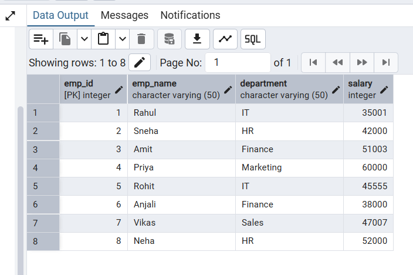
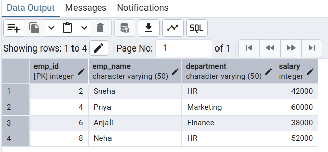
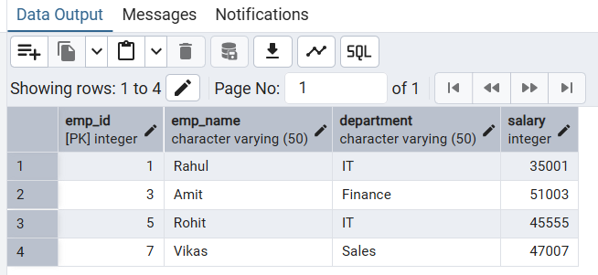
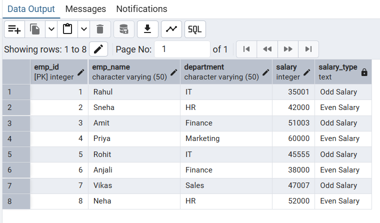

# Experiment 5: DBMS


## Name: Arnav Prajapati
## UID: 24BAI70131
## Section: 24AIT_KRG_G1

## 1. Aim of the Session
To demonstrate the creation of a database schema, population of records, and the use of the CASE Expression to perform conditional analysis on numerical data (parity check).

## 2. Objective of the Session
•	To learn how to manage table lifecycles using DROP and CREATE.
•	To understand the application of the modulo operator (%) in SQL.
•	To gain proficiency in creating virtual columns using CASE-WHEN-THEN-ELSE logic.
•	To practice basic Data Manipulation Language (DML) and Data Query Language (DQL) operations.

##  3. Practical / Experiment Steps
The experiment consists of the following logic:
1.	Table Setup: Ensure a clean environment by removing any existing employee table and creating a new one with specific constraints (Primary Key).
2.	Data Population: Insert six distinct records representing employee IDs, names, and salaries.
3.	Conditional Querying: Execute a SELECT statement that calculates the remainder of the salary divided by 2 (salary%2).
4.	Classification: If the remainder is 0, classify as 'Even Salary'; otherwise, classify as 'Odd Salary' using a CASE statement.

## 4. Procedure of the Practical
(i) Start your SQL environment (e.g., MySQL, PostgreSQL, or SQL Server Management Studio).
(ii) Open a new Query Editor window.
(iii) Create or select the required database schema.
(iv) Type the DROP and CREATE commands to define the table structure.
(v) Execute the INSERT commands to populate the table with the provided dataset.
(vi) Write the SELECT query incorporating the CASE expression for salary classification.
(vii) Execute the script and verify that the salary_type column correctly reflects the parity of the salary.
(viii) Note down the results and take a screenshot of the output grid.


## 5.	Code:

```sql
DROP TABLE IF EXISTS employee;

----------------------------

CREATE TABLE employee (
    emp_id SERIAL PRIMARY KEY,
    emp_name VARCHAR(50),
    department VARCHAR(50),
    salary INTEGER
)


-------------------------------
INSERT INTO employee (emp_name, department, salary) VALUES
('Rahul', 'IT', 35001),
('Sneha', 'HR', 42000),
('Amit', 'Finance', 51003),
('Priya', 'Marketing', 60000),
('Rohit', 'IT', 45555),
('Anjali', 'Finance', 38000),
('Vikas', 'Sales', 47007),
('Neha', 'HR', 52000)

----------------------------------

SELECT * FROM employee

----------------------------------


-- querry for even salary --
SELECT emp_id, emp_name, department, salary
FROM employee
WHERE salary % 2 = 0


-------------------------------------

-- querry for odd salary --

SELECT emp_id, emp_name, department, salary
FROM employee
WHERE salary % 2 != 0


-----------------------------------

-- using conditional logic --

SELECT 
    emp_id,
    emp_name,
    department,
    salary,
    CASE
        WHEN salary % 2 = 0 THEN 'Even Salary'
        ELSE 'Odd Salary'
    END AS salary_type
FROM employee

```


## 6. I/O Analysis (Input / Output Analysis)

Input: Employee Table Data

| emp_id | emp_name | department | salary |
| ---: | :--- | :--- | ---: |
| 1 | Rahul | IT | 35001 |
| 2 | Sneha | HR | 42000 |
| 3 | Amit | Finance | 51003 |
| 4 | Priya | Marketing | 60000 |
| 5 | Rohit | IT | 45555 |
| 6 | Anjali | Finance | 38000 |
| 7 | Vikas | Sales | 47007 |
| 8 | Neha | HR | 52000 |


Output: Query Results
| emp_id | emp_name | department | salary |
| ---: | :--- | :--- | ---: |
| 2 | Sneha | HR | 42000 |
| 4 | Priya | Marketing | 60000 |
| 6 | Anjali | Finance | 38000 |
| 8 | Neha | HR | 52000 |


emp_id	emp_name	department	salary
| emp_id | emp_name | department | salary |
| ---: | :--- | :--- | ---: |
| 1 | Rahul | IT | 35001 |
| 3 | Amit | Finance | 51003 |
| 5 | Rohit | IT | 45555 |
| 7 | Vikas | Sales | 47007 |


| emp_id | emp_name | department | salary | salary_type |
| ---: | :--- | :--- | ---: | :--- |
| 1 | Rahul | IT | 35001 | Odd Salary |
| 2 | Sneha | HR | 42000 | Even Salary |
| 3 | Amit | Finance | 51003 | Odd Salary |
| 4 | Priya | Marketing | 60000 | Even Salary |
| 5 | Rohit | IT | 45555 | Odd Salary |
| 6 | Anjali | Finance | 38000 | Even Salary |
| 7 | Vikas | Sales | 47007 | Odd Salary |
| 8 | Neha | HR | 52000 | Even Salary |

## 7.	Output Screenshot:
 

 

 


 


## 8. Learning Outcome
Through this practical session, I have:
•	Concepts Understood: Mastered the CASE statement syntax, which allows for "if-then-else" logic directly within a SQL result set.
•	Skills Developed: Gained the ability to categorize data dynamically without altering the physical storage of the table.
•	Practical Exposure: Learned how to handle table resets (Drop/Create) and perform mathematical operations like modulo within a query to derive meaningful business insights.

