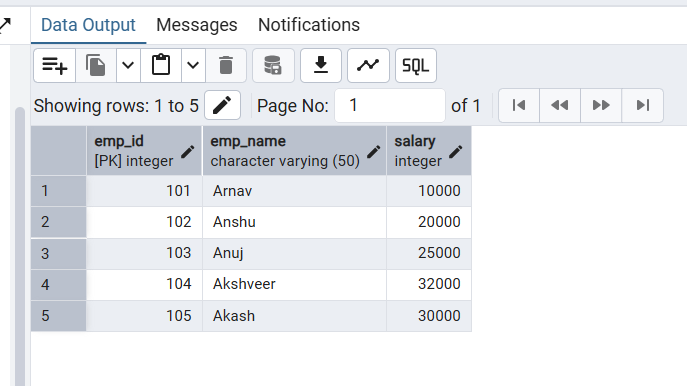
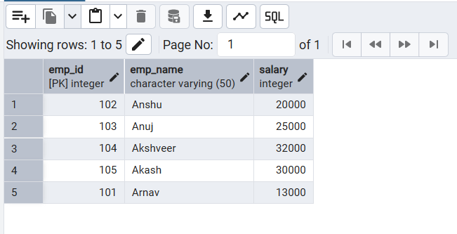
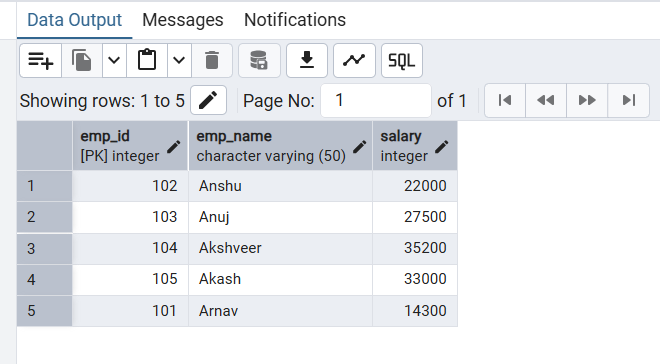

# Experiment 6: DBMS

## Name: ARNAV PRAJAPATI
## UID: 24BAI70131
## Section: 24AIT_KRG_G1

## 1. Aim of the Session:

To understand the concept and working of cursors for row-by-row data processing, specifically utilizing an explicit cursor to iterate through a dataset and apply a 10% salary increment to each record.

## 2. Objective of the Session:
•	To implement a lifecycle-managed explicit cursor (OPEN, FETCH, CLOSE).
•	To differentiate between set-based SQL updates and row-by-row cursor updates.
•	To master the use of the FOUND/NOT FOUND status indicators to control loop execution.
•	To practice environment cleanup and table management using DROP and CREATE.

## 3. Practical / Experiment Steps:
The experiment follows this execution logic:
•	Initialization: Dropping existing structures and creating a fresh employee table with 5 specific records.
•	Direct Update: Performing a standard SQL update on a single record (emp_id = 211) to demonstrate implicit processing.
•	Cursor Declaration: Defining emp_cursor to hold the Result Set of IDs and Salaries.
•	Row-by-Row Processing:
o	Opening the cursor to establish the context area.
o	Using a LOOP to fetch each employee's ID and current Salary into local variables.
o	Applying a 10% hike ($Salary * 1.10$) individually to every row.
o	Terminating the loop once all rows are processed (EXIT WHEN NOT FOUND).
•	Final Verification: Displaying the final state of the table to confirm the cumulative changes.

## 4. Procedure of the Practical:
1.	Start the system and log in to the pgAdmin or psql terminal.
2.	Clean the environment by executing the DROP command to avoid "Table already exists" errors.
3.	Define the Schema by creating the employee table with ID, Name, and Salary columns.
4.	Insert the dataset for employees 204, 206, 207, 209, and 211.
5.	Perform the manual update to observe how direct SQL works without a cursor.
6.	Write the Anonymous Block (DO $$...$$):
o	Declare variables emp and sal.
o	Define the CURSOR for the selection.
o	Implement the LOOP and FETCH logic.
o	Ensure the CLOSE statement is included to release database resources.
7.	Execute the script and analyze the output messages.
8.	Verify the final results using a SELECT * query.

## 5.Code:
```
    drop table if exists employee;
    create table employee
    (
        emp_id int primary key,
        emp_name varchar(50),
        salary int
    );


    insert into employee values(101, 'Arnav', 10000);
    insert into employee values(102, 'Anshu', 20000);
    insert into employee values(103, 'Anuj', 25000);
    insert into employee values(104, 'Akshveer', 32000);
    insert into employee values(105, 'Akash', 30000);

    select * from employee


    -----------------------Implicit cursor----------------------------

    update employee
    set salary = salary + 3000
    where emp_id = 101;

    select * from employee

    --------------------------Explicit Cursor-----------------------------------
    DO $$
    DECLARE
        emp INT;
        sal INT;
        emp_cursor CURSOR FOR 
            SELECT emp_id, salary FROM employee;
    BEGIN
        OPEN emp_cursor;

        LOOP
            FETCH emp_cursor INTO emp, sal;
            EXIT WHEN NOT FOUND;

            UPDATE employee
            SET salary = sal * 1.10
            WHERE emp_id = emp;

        END LOOP;

        CLOSE emp_cursor;
    END $$;

    SELECT * FROM employee;
```


## 6. I/O Analysis (Input / Output Analysis)

### Input Provided (Initial Data):
emp_id	emp_name	Initial Salary
101	Arnav	10000
102	Anshu	20000
103	Anuj	25000
104	Akashveer	32000
105	Akash	30000

### Intermediate Step (Direct Update):
•	Update emp_id  101: $10000 + 3000 = 13000$.
Output Results (Final State after Cursor 10% Hike)
emp_id	emp_name	old_salary	calculation	final_salary
101	Arnav	10000	10000 * 1.10	11000
102	Anshu	20000	20000 * 1.10	22000
103	Anuj	25000	25000 * 1.10	27500
104	Akshveer	32000	32000 * 1.10	35200
105	Akash	30000	30000 * 1.10	33000


## 7. Output Screenshots:
A:



B:



C:
 


## 8. Learning Outcome and Result
By completing this practical, I have learned:
•	Concepts Understood: How an explicit cursor acts as a pointer to a result set, allowing the database engine to process rows one at a time.
•	Skills Developed: Gained the ability to write procedural SQL blocks in PostgreSQL using DO $$ and managing cursor status via FOUND.
•	Practical Exposure: Understood that while cursors offer high control for complex business logic, they are computationally more expensive than bulk updates and should be used specifically for row-dependent processing tasks.

