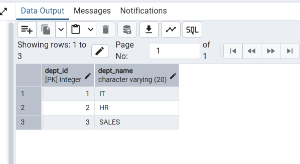
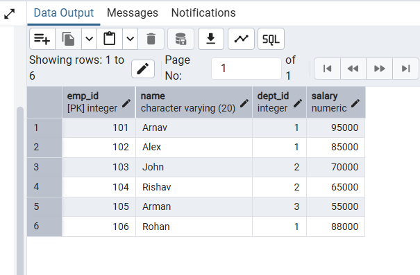
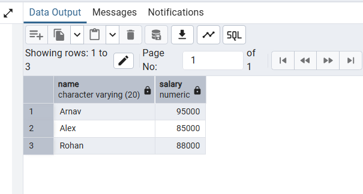
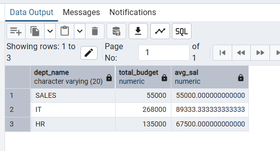
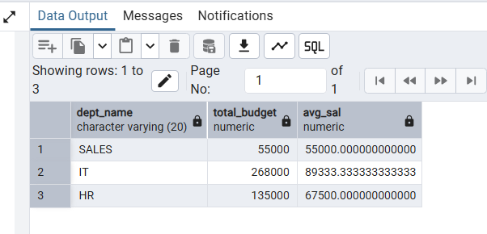
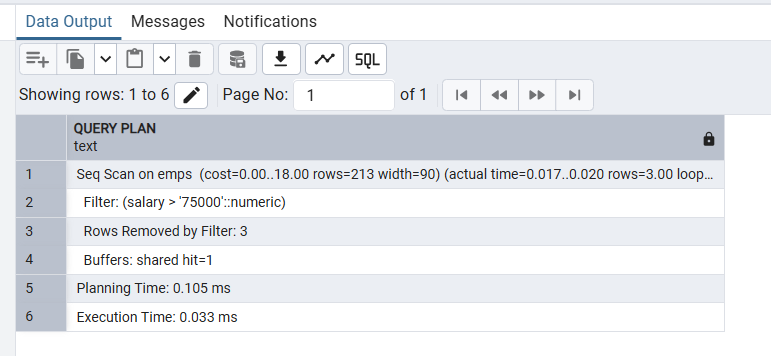
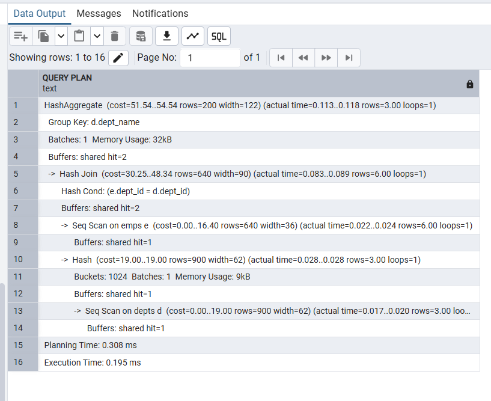
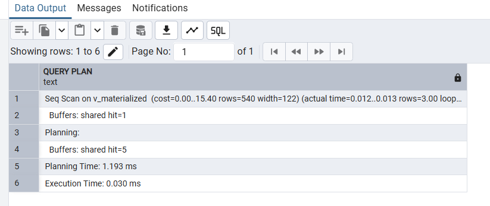

# Experiment 7

## Student Name: Arnav Prajapati
## UID: 24BAI70131
## Branch: CSE - AIML
## Section/Group: 24AIT_KRG G1
## Date of Performance: 13/3/26


## 1.  Aim
To design and implement a materialised view and to compare and analyse execution time and performance differences between simple views, complex views, and materialized views, thereby understanding their impact on query optimization and system performance.


## 2. Software Requirements
•	Database Management System:
o	Oracle Database Express Edition (Oracle XE)
o	PostgreSQL Database
•	Database Administration Tool / Client Tool:
o	Oracle SQL Developer (for Oracle XE)
o	pgAdmin (for PostgreSQL)


## 3. Objectives
•	To create simple views, complex views, and materialized views, and to evaluate their performance by comparing query execution time for each, highlighting the advantages of materialized views in enterprise-level applications.


## 4. Practical/Experiment Steps
•	Relational Schema Construction: Developed the depts and emps tables, establishing a primary-foreign key relationship to simulate an enterprise organizational structure.
•	Simple View Implementation: Created a standard virtual view (V_SIMPLE) to filter specific columns and rows from a single table based on salary thresholds.
•	Complex Logic Aggregation: Designed a complex view (V_COMPLEX) that integrates multi-table joins and aggregate functions like SUM() and AVG() for departmental budgeting.
•	Materialized Storage Configuration: Implemented a Materialized View (V_MATERIALIZED) to physically store precomputed query results, reducing the overhead of real-time calculations.
•	Performance Benchmark Analysis: Utilized the EXPLAIN ANALYZE utility to measure and compare the execution costs and retrieval times across all three view types.
•	Data Refresh Synchronization: Executed the REFRESH MATERIALIZED VIEW command to ensure the stored data reflects the most recent updates from the underlying base tables.


## 5. Procedure
•	Initialized the PostgreSQL environment via pgAdmin and established a connection to the local database server.
•	Executed the DDL scripts to create the depts and emps tables and populated them with representative organizational data.
•	Defined a Simple View to extract high-salary employee names and verified the output with a basic SELECT statement.
•	Constructed a Complex View using an INNER JOIN and GROUP BY clause to calculate total and average salaries by department.
•	Created a Materialized View using the same logic as the complex view to demonstrate how results are persisted in storage.
•	Simulated a data update scenario and practiced the REFRESH command to synchronize the materialized view with the base tables.
•	Conducted an execution time analysis by running EXPLAIN ANALYZE on each view to observe the differences in query planning and execution speed.
•	Evaluated the performance metrics, noting the shift from real-time computation in complex views to direct data retrieval in materialized views.
•	Saved the execution logs and performance reports to document the efficiency gains achieved through materialized caching.


## 6. SQL QUERIES
```
    CREATE TABLE depts(
    dept_id INT PRIMARY KEY,
    dept_name VARCHAR(20)
    );

    CREATE TABLE emps(
    emp_id INT PRIMARY KEY,
    name VARCHAR(20),
    dept_id INT REFERENCES depts(dept_id),
    salary NUMERIC
    );

    INSERT INTO depts VALUES(1, 'IT'), (2, 'HR'), (3, 'SALES');
    SELECT * FROM depts

    INSERT INTO emps VALUES(101, 'Arnav', 1, 95000);
    INSERT INTO emps VALUES(102, 'Alex', 1, 85000);
    INSERT INTO emps VALUES(103, 'John', 2, 70000);
    INSERT INTO emps VALUES(104, 'Rishav', 2, 65000);
    INSERT INTO emps VALUES(105, 'Arman', 3, 55000);
    INSERT INTO emps VALUES(106, 'Rohan', 1, 88000);
    SELECT * FROM emps

    CREATE VIEW V_SIMPLE AS
    SELECT name, salary FROM emps WHERE salary>75000;
    SELECT * FROM V_SIMPLE;

    CREATE VIEW V_COMPLEX AS
    SELECT d.dept_name, SUM(e.salary) AS total_budget, AVG(e.salary) AS avg_sal
    FROM emps e JOIN depts d
    ON e.dept_id = d.dept_id
    GROUP BY d.dept_name;
    SELECT * FROM V_COMPLEX;

    CREATE MATERIALIZED VIEW V_MATERIALIZED AS
    SELECT d.dept_name, SUM(e.salary) AS total_budget, AVG(e.salary) AS avg_sal
    FROM emps e JOIN depts d
    ON e.dept_id = d.dept_id
    GROUP BY d.dept_name;
    SELECT * FROM V_MATERIALIZED;

    REFRESH MATERIALIZED VIEW V_MATERIALIZED;
    EXPLAIN ANALYZE SELECT * FROM V_SIMPLE;
    EXPLAIN ANALYZE SELECT * FROM V_COMPLEX;
    EXPLAIN ANALYZE SELECT * FROM V_MATERIALIZED;

```


## 7. Input/Output Analysis

### Input Tables:

1
| dept_id | dept_name |
|---------:|----------|
| 1       | IT       |
| 2       | HR       |
| 3       | SALES    |




2
| emp_id | name   | dept_id | salary |
|--------:|-------:|--------:|-------:|
| 101    | Arnav  | 1      | 95000  |
| 102    | Alex   | 1      | 85000  |
| 103    | John   | 2      | 70000  |
| 104    | Rishav | 2      | 65000  |
| 105    | Arman  | 3      | 55000  |
| 106    | Rohan  | 1      | 88000  |




### Output:

A:
```
    CREATE VIEW V_SIMPLE AS
    SELECT name, salary FROM emps WHERE salary>75000;
    SELECT * FROM V_SIMPLE;

```



B:
```
    CREATE VIEW V_COMPLEX AS
    SELECT d.dept_name, SUM(e.salary) AS total_budget, 
    AVG(e.salary) AS avg_sal
    FROM emps e JOIN depts d
    ON e.dept_id = d.dept_id
    GROUP BY d.dept_name;
    SELECT * FROM V_COMPLEX; 

```



C:
```
    CREATE MATERIALIZED VIEW V_MATERIALIZED AS
    SELECT d.dept_name, SUM(e.salary) AS total_budget,
    AVG(e.salary) AS avg_sal
    FROM emps e JOIN depts d
    ON e.dept_id = d.dept_id
    GROUP BY d.dept_name;

```



D:
```
    REFRESH MATERIALIZED VIEW V_MATERIALIZED; 

    EXPLAIN ANALYZE SELECT * FROM V_SIMPLE;

```



```
    EXPLAIN ANALYZE SELECT * FROM V_COMPLEX;

```



```
    EXPLAIN ANALYZE SELECT * FROM V_MATERIALIZED;
```



## 8. Learning Outcomes
•	Gained proficiency in differentiating between virtual simple/complex views and physically stored materialized views.
•	Gained the ability to use EXPLAIN ANALYZE to interpret query plans and identify performance bottlenecks.
•	Learned the lifecycle of materialized views, including creation, storage benefits, and manual refresh mechanisms.
•	Understanding how precomputing results in materialized views supports high-performance requirements for companies like SanDisk and PayPal.
